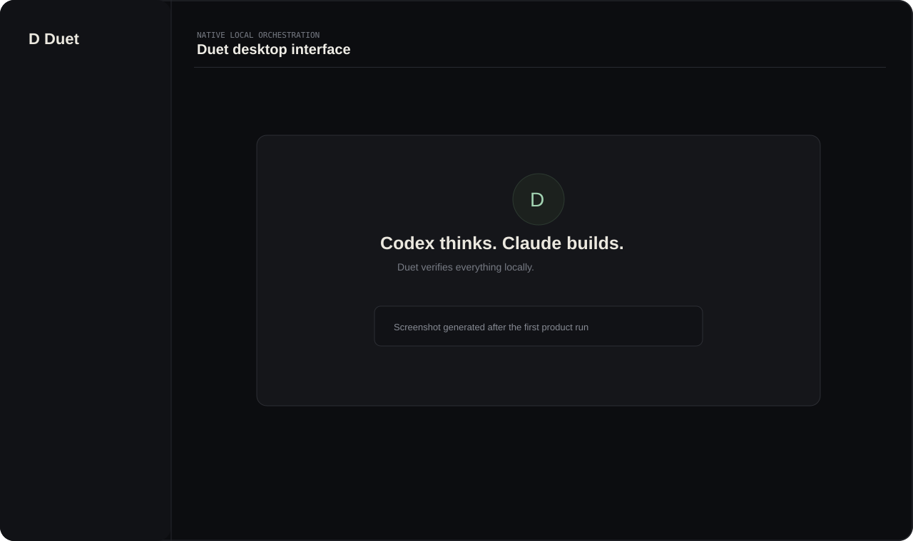
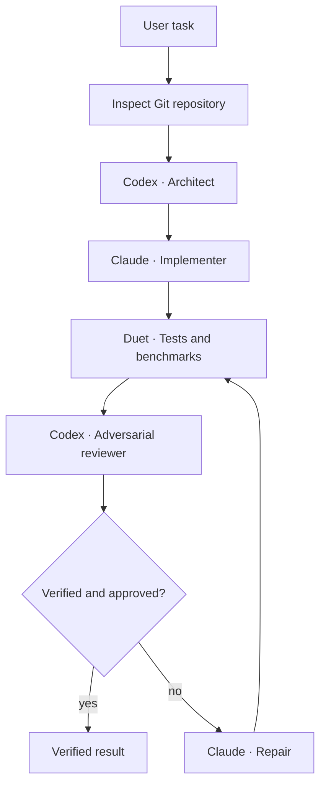

# Duet

**Codex thinks. Claude builds. Codex attacks. Claude repairs. Duet proves.**

Duet is a local-first native desktop orchestrator for the Claude Code and OpenAI Codex CLIs. It uses the coding-agent subscriptions already authenticated on your computer—never the Anthropic API or OpenAI API—and isolates every implementation in a temporary Git worktree until you explicitly apply it.



## The workflow



The machine has the final say. A positive model review never overrides a failing required check.

## What works

- Add and inspect local Git repositories, including branch, SHA, dirty state, language, build system, and suggested tests.
- Detect the locally installed `claude`, `codex`, and `git` executables and inspect authentication status where the CLI supports it.
- Create one app-managed branch and worktree for every run. Agents never edit the selected working tree.
- Stream typed lifecycle events and stdout/stderr from cancellable, timeout-bounded Tokio subprocesses.
- Run Codex as architect/reviewer and Claude as implementer/repairer through supported headless CLI modes.
- Run required tests and optional benchmarks independently of model opinion.
- Repeat review/repair up to a user-selected bound and stop on repeated no-op repairs.
- Persist projects, runs, stages, raw output, normalized output, verification, reviews, changed files, and events in SQLite.
- Reopen historical runs after restart; active runs become `interrupted` rather than incorrectly appearing complete.
- Inspect a live timeline, activity, changed files, unified diff, tests, structured review, and raw logs.
- Explicitly apply a binary Git patch only after checking that the target SHA is unchanged and its working tree is clean.
- Run a complete no-usage development flow with **Mock agents** enabled.

## Privacy and safety

Duet has no Duet cloud service and contains no OpenAI or Anthropic API client. Source code, prompts, logs, diffs, and run history remain in the operating system's application-data directory. The official local agent CLIs may make their normal service connections under their own terms and authentication.

Duet does not automatically merge, commit, push, force-update, or mutate a remote. Removing a project only removes it from Duet. Discarding a run checks that its path is inside Duet's managed worktree directory before asking Git to remove it.

## Requirements

- macOS 12 or newer (Apple Silicon build documented here)
- Node.js 20 or newer and npm
- Rust stable toolchain
- Git
- Claude Code CLI
- OpenAI Codex CLI

Verify the tools:

```bash
git --version
claude --version
codex --version
```

### Authenticate Claude Code

Install Claude Code using Anthropic's official instructions, run `claude`, and complete its official subscription login flow. Confirm with:

```bash
claude auth status
```

Duet does not accept or store an Anthropic API key.

### Authenticate Codex

Install Codex using OpenAI's official instructions, then use its ChatGPT subscription login:

```bash
codex login
codex login status
```

Duet does not accept or store an OpenAI API key.

## Development

```bash
git clone https://github.com/atkunja/duet.git
cd duet
npm install
npm run tauri dev
```

Frontend-only production compilation:

```bash
npm run build
```

Native tests and checks:

```bash
cargo test --manifest-path src-tauri/Cargo.toml
cargo check --manifest-path src-tauri/Cargo.toml
```

Frontend tests:

```bash
npm test
```

## Production build

Create the native application and DMG with:

```bash
npm run tauri build
```

On Apple Silicon, unsigned local artifacts are written to:

```text
src-tauri/target/release/bundle/macos/Duet.app
src-tauri/target/release/bundle/dmg/Duet_0.1.0_aarch64.dmg
```

Code signing is intentionally not required for local development. Public distribution will require an Apple Developer ID certificate, hardened runtime configuration, signing, and notarization.

## Try it safely

Create a tiny repository:

```bash
mkdir /tmp/duet-example
cd /tmp/duet-example
git init
npm init -y
printf 'export const add = (a, b) => a + b;\n' > index.js
git add .
git commit -m "initial example"
```

Open Duet, choose **Add a repository**, select `/tmp/duet-example`, enable **Mock agents**, enter `Document the project`, and run it. Duet creates an isolated worktree, adds `DUET_MOCK_RESULT.md`, verifies the configured command, obtains a mock structured review, and displays the patch without touching `/tmp/duet-example`.

A realistic live-agent task might be:

> Add bounded concurrent job execution with graceful shutdown, cancellation tests, and backwards-compatible configuration.

Leave Mock agents disabled. Codex will inspect and plan, Claude will implement, Duet will execute the repository's tests, and Codex will review the resulting diff before any repair round.

## Repository configuration

Duet auto-detects common Cargo, Node, Python, Go, CMake, Maven, and Gradle projects. Commands can be overridden in the task composer. The internal models are ready for a repository-level `duet.toml`; an example is provided in [`duet.toml.example`](duet.toml.example).

## Architecture

```text
React / TypeScript
  typed commands + structured Tauri events
              │
Rust / Tauri / Tokio
  ├─ agent adapters (Claude and Codex JSONL normalization)
  ├─ task graph and bounded workflow executor
  ├─ cancellable subprocess streaming
  ├─ deterministic verification
  ├─ Git repository/worktree safety
  └─ SQLite state and restart recovery
              │
     app-managed Git worktree
```

The backend deliberately exposes task-specific commands instead of a generic shell command to frontend JavaScript. Role prompts are separate and agent adapters share a common `Agent` trait, so routing can evolve without rewriting the workflow core.

## Application data

On macOS, Tauri resolves Duet's application data under the normal per-user Application Support location. It contains:

```text
duet.sqlite3
worktrees/<run-id>/implementation/
```

No state is scattered into a selected repository except files an agent intentionally changes inside the isolated worktree. A future release will read an optional `duet.toml` from the repository.

## Troubleshooting

- **CLI missing:** Open Settings & Doctor and confirm the executable path. Launching Duet from Finder can have a narrower `PATH` than your shell; support for manual executable selection is planned.
- **Authentication unknown:** Run `claude auth status` or `codex login status` in Terminal. Some CLI versions do not expose a machine-readable status.
- **Worktree creation fails:** Ensure the repository has at least one commit and no conflicting `duet/run-*` branch.
- **Apply is blocked:** The original repository must still be on the run's base commit and have a clean working tree. This is intentional.
- **Run interrupted:** The prior process cannot be reattached after an application exit. Duet preserves its worktree and marks the run interrupted.

## Current limitations

- V1 targets macOS and emits a unified diff; side-by-side diff mode is not yet included.
- CLI authentication detection depends on each installed CLI's status command and may report “not detectable.”
- Agent escalation (Codex implementing after repeated Claude failures) is represented by role-independent adapters but is not exposed as an automatic policy yet.
- `duet.toml` is documented and modeled conceptually but GUI command overrides are the active configuration path in V1.
- Benchmark output is retained generically; metric-specific latency/throughput parsers are future work.
- Interrupted OS processes are terminated by application shutdown and cannot be resumed; only their state and worktree are recovered.

## Contributing

Keep the local-first and worktree-safety invariants intact. New agent integrations must use official local CLIs, persist raw and normalized output, remain cancellation-aware, and have tests that do not consume agent subscriptions. Run all frontend and Rust tests before opening a pull request.

## License

MIT. See [LICENSE](LICENSE).
